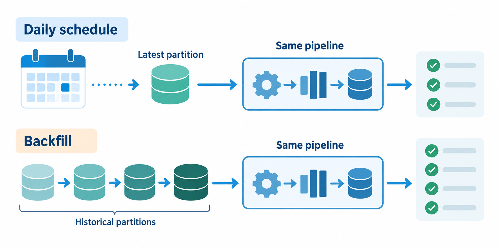

# Local DB: Learn Scheduling and Backfills

We can now schedule the same pipeline shown above to run daily at 9 AM UTC. We'll also demonstrate how to backfill the data pipeline to run on historical data.

Note: given the large dataset, we'll backfill only data for the green taxi dataset for the year 2019.

*Scheduling handles new data; backfills reuse the same logic for historical partitions.*

The flow code: [`05_postgres_taxi_scheduled.yaml`](flows/05_postgres_taxi_scheduled.yaml).
