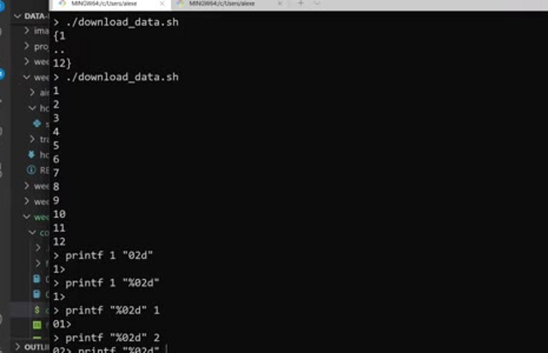
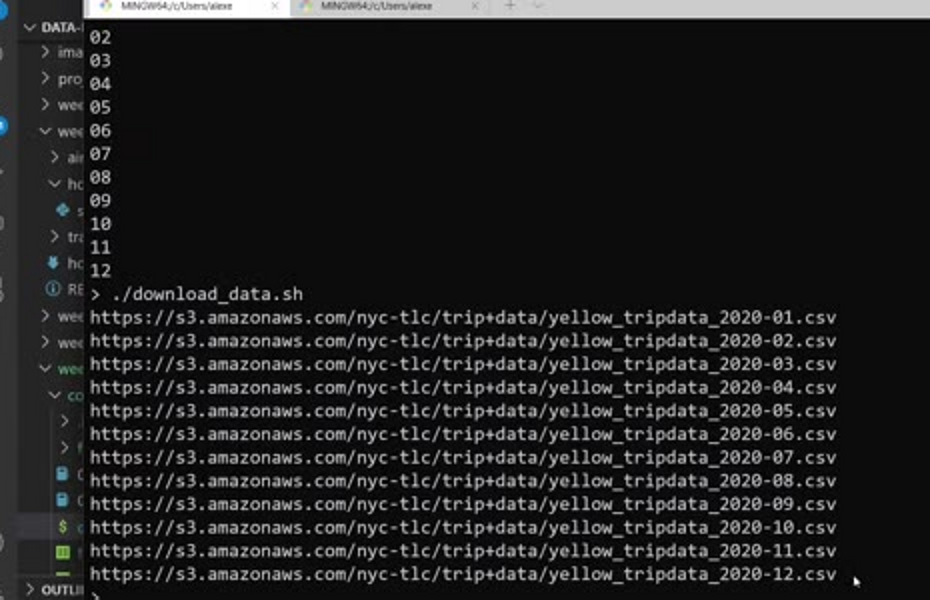
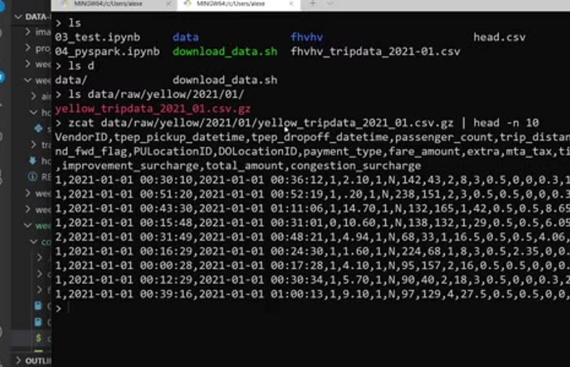
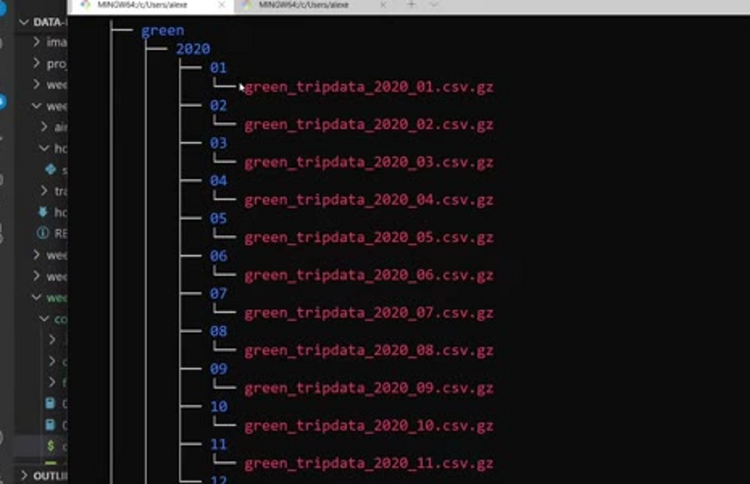
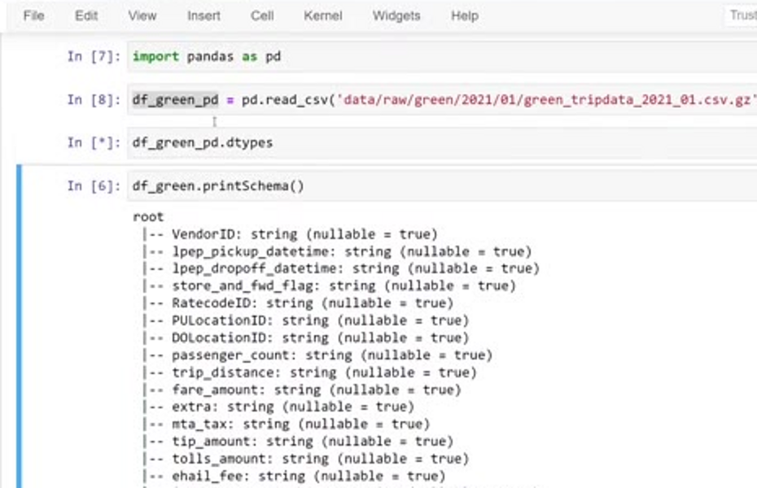
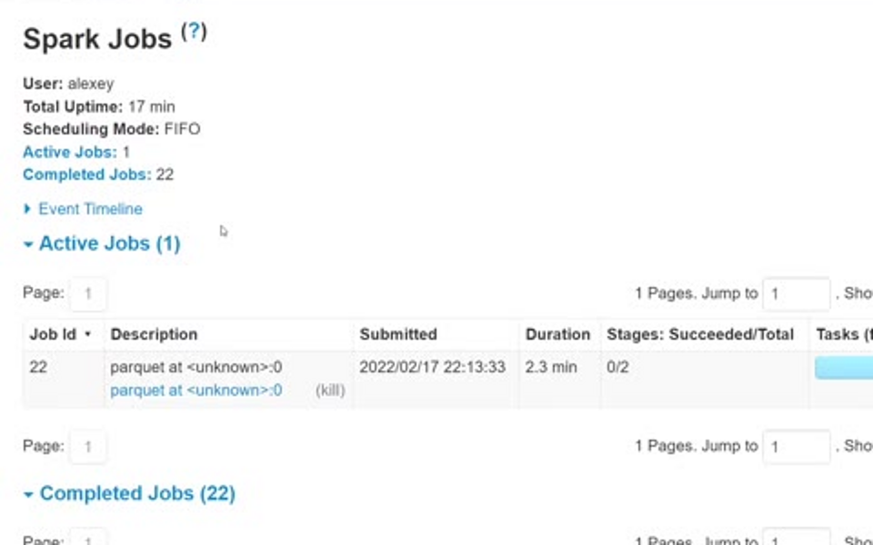
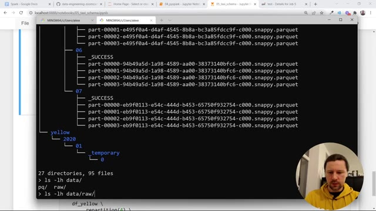

# Preparing Yellow and Green Taxi Data

In this (optional) unit we prepare the yellow and green taxi datasets for
this module: we download the raw files, define an explicit schema for each
taxi type, and rewrite everything as parquet. The goal is to make sure that
later, when we combine months and years, the schemas match and there are no
surprises.

## The data we need

In previous weeks, students copied data to the data lake in different ways,
and that caused problems with schemas and types. So in this unit we do the
preparation once, carefully, and use the result for the rest of the module.

We take the yellow and green taxi data for 2020 and 2021. We pick these two
datasets because in week 4 (analytics engineering) we already used them, and
here we will run similar computations on them with Spark.

The data lives on the NYC TLC (Taxi and Limousine Commission) website, which
lists trip records per month:

The URLs follow the same pattern - only the taxi type, the year and the month
change. That makes them easy to generate in a loop.

## A bash script for downloading the data

We write a small bash script, `download_data.sh`, that takes two parameters:
the taxi type (for example `yellow`) and the year (for example `2020`). Then
it loops over the months from 1 to 12 and downloads one CSV file per month.

There is one small detail: in the URL, the month is zero-padded - January is
`01`, not `1`. To add the leading zero we use `printf` with the template
`%02d`: `%0` means "pad with zeros", `2` means "two characters in total" and
`d` means "it's a digit". This formatting syntax comes from C, and bash
borrowed it:

```bash
FMONTH=`printf "%02d" ${MONTH}`
```



With that we can assemble the URL for each month and check it with `echo`
before actually downloading anything:



For each file we also build the local path: `data/raw/<taxi type>/<year>/<month>`,
so every month gets its own folder. We create the folder with `mkdir -p`
(`-p` also creates the parent directories) and save the file there with
`wget`:

```bash
mkdir -p ${LOCAL_PREFIX}
wget ${URL} -O ${LOCAL_PATH}
```

CSV files are large, so we compress them with gzip. gzip is a good choice
because both pandas and Spark can read compressed files without any extra
unpacking. By default gzip removes the original file after compressing it.

One more thing: some months do not exist (at the time of recording, there was
no August 2021 data). For a missing file, `wget` gets a 404 and exits with a
non-zero code. We add `set -e` to the script so it stops at the first error
instead of continuing with the remaining months.

After downloading 2021 yellow, we run the same script for green 2021, yellow
2020 and green 2020. Note that the 2020 data is quite unbalanced: January is
big, then because of Covid there are very few trips, and by the end of the
year it partially recovers.

## Checking the downloaded files

While the script runs, it prints what it does: downloading and compressing
messages. We can check the content of a compressed file without unpacking it
with `zcat` - the same as `cat`, but for gzipped files:

```bash
zcat data/raw/yellow/2021/01/yellow_tripdata_2021_01.csv.gz | head -n 10
```



And `tree` shows us the folder structure we ended up with: for each taxi
type and year, one folder per month with a compressed CSV inside:



## Defining the schema

Now we want to read these CSV files in Spark, define a schema for them, and
save them as parquet with that schema. Because we define the schema here,
later computations will not run into surprises.

First we read one month the usual way:

```python
df_green = spark.read \
    .option("header", "true") \
    .csv('data/raw/green/2021/01/*')
```

We can point to a folder (or even use `*` to read the whole year) - Spark
will read all files in it. If we print the schema now, we see the column
names, but everything is a string:



The way we inferred types before: read the same file with pandas, which
figures out the types for us. Because pandas can read gzipped files directly,
no unpacking is needed:

```python
import pandas as pd

df_green_pd = pd.read_csv(
    'data/raw/green/2021/01/green_tripdata_2021_01.csv.gz',
    nrows=1000
)
```

Then we turn this pandas DataFrame into a Spark DataFrame and look at its
schema:

```python
spark.createDataFrame(df_green_pd).schema
```

We copy that schema and clean it up in an editor: add line breaks, quote the
names, put `types.` in front of the datatypes and capitalize `True` - we end
up with a `types.StructType` with one `types.StructField` per column, which
we assign to `green_schema`.

This schema is not perfect yet, so we edit it a little:

- the pickup and dropoff times should be `TimestampType`, not date
- IDs and counts (`VendorID`, `passenger_count`, `RatecodeID`,
  `PULocationID`, `DOLocationID`) are not very large numbers, so `IntegerType`
  is enough - it takes 4 bytes instead of 8 of `LongType`
- the money columns stay as `DoubleType` (float or decimal would also work)

We do the same for the yellow dataset and get `yellow_schema`.

## Rewriting everything as parquet

Now we take each monthly CSV, read it with the explicit schema, and write it
as parquet:

```python
df_green = spark.read \
    .option("header", "true") \
    .schema(green_schema) \
    .csv(input_path)

df_green \
    .repartition(4) \
    .write.parquet(output_path)
```

We do this in a loop over the months (in Python, `range(1, 13)` covers months
1 to 12; we also format the month with a leading zero using an f-string).
Input comes from `data/raw/`, output goes to `data/pq/` - same structure, but
parquet instead of CSV.

Why `repartition(4)`? When Spark reads a gzipped file, it cannot split it
into multiple partitions - the whole file goes to one partition. We have four
cores on this machine, so we repartition to four partitions to use all of
them. We can watch this in the Spark UI: first only one task runs (one
executor going through the CSV file), which then writes the results to four
temporary files that end up on disk:



We run this for all four combinations: green and yellow, 2020 and 2021.

## The result

Looking at `data/pq` with `tree`, each month now has four parquet part-files
(the result of the repartition) plus a `_SUCCESS` marker:



Comparing sizes with `ls -lh`: the compressed yellow CSV for January 2020 is
111 MB, and the parquet version is actually slightly bigger - gzip compresses
CSV quite well. But the benefit of parquet here is not the size: the schema
is built in. Because we made sure that all files follow the same schema, we
can combine months and years later without any strange surprises.

One more way to infer the schema of the CSV files (apart from pandas) is to
set the `inferSchema` option to `true` when reading them in Spark.

The final versions of both the download script and the schema notebook are
in the Materials section below - you can just execute them instead of
following along.

## Materials

* [`code/download_data.sh`](code/download_data.sh) - downloads the yellow and
  green trip data for 2020 and 2021 into `data/raw/`.
* [`code/05_taxi_schema.ipynb`](code/05_taxi_schema.ipynb) - the explicit green
  and yellow schemas, and the loop that rewrites each month as partitioned
  parquet under `data/pq/`.
