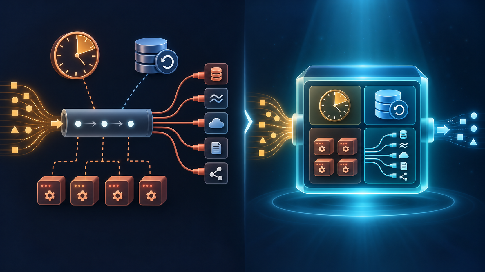

# Why Flink?

Flink is a stream processing framework that handles all the hard parts:

- Windowing - built-in tumbling, sliding, and session windows
- Checkpointing - automatic state recovery after failures (no manual offset tracking)
- Parallelism - distribute processing across multiple workers
- Connectors - built-in JDBC, Kafka, filesystem sinks (no psycopg2 code)
- SQL interface - express stream processing with SQL queries

Flink can also connect to sources beyond Kafka - REST APIs, websockets,
filesystems, and more. But Kafka is the most common source in stream processing.

*Flink adds infrastructure to manage, but it pays off when streaming jobs need state, scale, resilience, or multiple sinks.*

The trade-off is infrastructure complexity - we need the JobManager and
TaskManager containers. A streaming job is more like owning a server than
running a batch pipeline - it runs 24/7 and needs monitoring. But for anything
beyond simple consume-and-write, Flink pays for itself.
