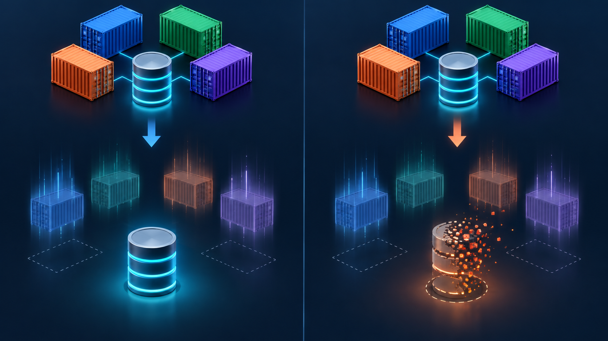

# Cleanup



*`docker compose down` removes the services while preserving the volume; adding `-v` removes the persisted database data too.*

Stop and remove all containers:

```bash
docker compose down
```

To also remove the PostgreSQL data volume:

```bash
docker compose down -v
```
